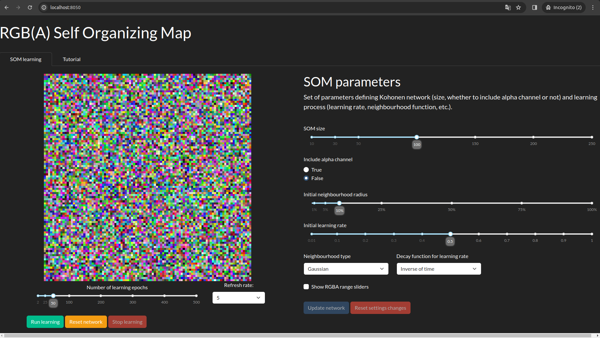

# About application
This application allows you to play with Self-organizing maps (Kohonen netowrk) and understand
how doeas it work. The Kohonen network is represented by an RGB(A) bitmap, 
which makes it easy to see if the learning process went well and to understand 
the influence of individual parameters on the learning process.

# Launching an app
You can launch the application directly using python script or deploy it with a docker
container.

## Python script
As a first step install required python packages (it is good idea to set up virtual 
environment before running this line):

```shell
pip install -r requirements.txt
```

Change directory to the *som-app*:

```shell
cd som-app
```

Run following command:
```shell
python app.py
```

That's all! You can open your browser and visit **localhost:8050**:



## Docker container
You can also deploy app using docker container. Go to the root directory of the repo and build
docker image. For Linux system command would be as follows:

```shell
sudo docker build -t som-app .
```

As a next step run container specifying ports mapping:

```shell
sudo docker run -p 8050:8050 --name som-app som-app
```

And again, that's all. You can visit **localhost:8050** in the browser.